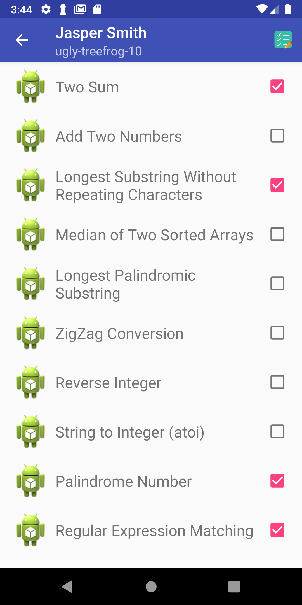
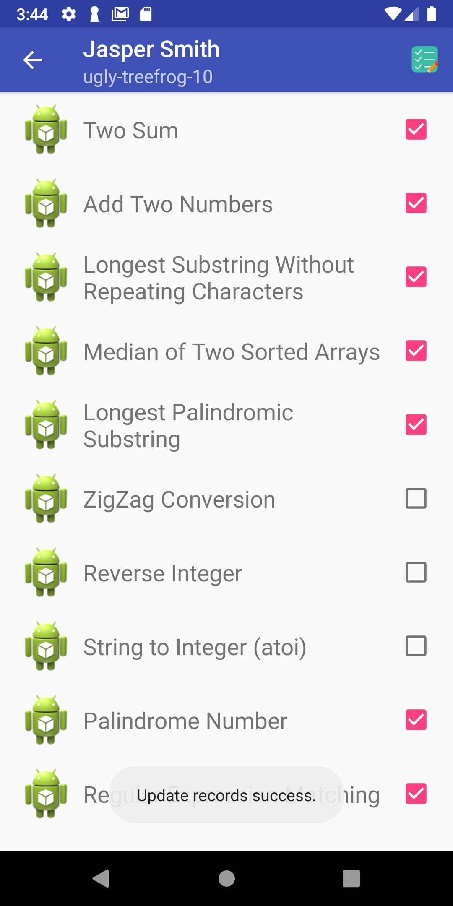

# StudentHomeWork

`StudentHomeWork` is an app that helps teachers/TAs to update student homework status. 

* Developed the app with Java and PHP. But I recently refactor this project use retrofit for client and ktor framework for backend.

backend: [student-homework-ktor](https://github.com/tonyyang924/student-homework-ktor)

## Development Setup

### Setup Local environment 

1. clone backend project [student-homework-ktor](https://github.com/tonyyang924/student-homework-ktor) and launch backend service.

2. Make sure that Android device and PC should connect to the same network, open terminal then type `ifconfig` or `ifconfig | grep 192.` to check your internal IP address. 
```
$ ifconfig | grep 192.
inet 192.168.0.104 netmask 0xffffff00 broadcast 192.168.0.255
```

3. Set `BASE_URL` in your `~/.gradle/gradle.properties`, for example:
```
BASE_URL=http://192.168.0.104:5001
```

---



